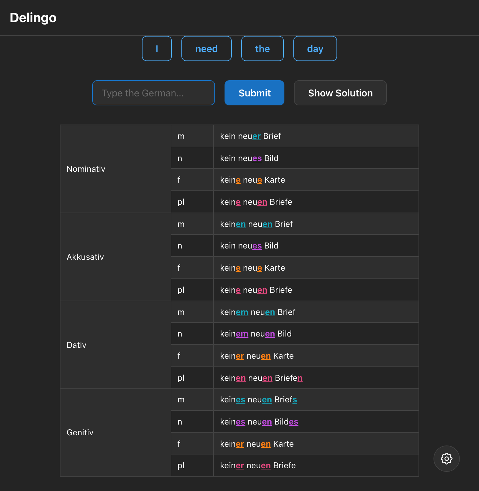

# Delingo

A German language learning app — gamified drills for mastering articles (der/die/das) and grammatical cases.



## Getting Started

### Requirements

- [Node.js](https://nodejs.org/) 24+ (we recommend installing via a version manager like [fnm](https://github.com/Schniz/fnm))
- [Yarn](https://yarnpkg.com/) 4

### Installing Dependencies

```bash
yarn install
```

### Configuring Environment Variables

Copy the sample env file and fill in the values:

```bash
cp .env.sample .env
```

See `src/helpers/env.mjs` for how each variable is validated.

### Local Development

Start a dev server at [http://localhost:3000](http://localhost:3000):

```bash
yarn dev
```

Or develop components in isolation with Storybook at [http://localhost:6006](http://localhost:6006):

```bash
yarn storybook
```

### Building for Production

```bash
yarn build
yarn start
```

### Linting & Testing

```bash
yarn test             # Vitest
yarn lint             # Typecheck + ESLint + Prettier
yarn lint:typecheck   # TypeScript only
yarn lint:eslint      # ESLint only
yarn lint:formatting  # Prettier check only
```
